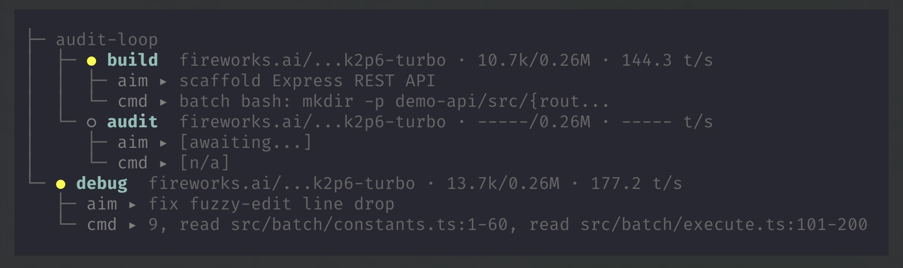

# Pi Agent Flow 🌊

<p align="center">
  <a href="https://www.npmjs.com/package/pi-agent-flow"></a>
  <a href="./LICENSE"></a>
</p>

<p align="center">
  <strong>Flow-state transition for the <a href="https://pi.dev">Pi coding agent</a>.</strong> <br/>
  Isolate context, run specialist agents in parallel, and get structured results back!
</p>

---

## Why This Exists

Long conversations can get messy—context bloats, tool calls get duplicated, and the real signal gets lost in the noise. **Pi Agent Flow** solves this by forking each task into a focused, isolated child process with only the context it actually needs. 

The parent stays clean; the workers stay focused.

*   **No more duplicate work:** Skip re-running the same `read` or `grep` commands.
*   **Keep it clean:** Your main conversation thread stays free from endless transcripts.
*   **Laser focus:** Each flow locks onto its intent without getting distracted by past messages.
*   **Run in parallel:** Batch multiple tasks concurrently and get clean, structured results back.

## See it in Action



## Quickstart

Install the extension via the Pi CLI:

```shell
pi install npm:pi-agent-flow
```

Then, jump right in and transition tasks in parallel:

```shell
pi
{ "flow": [
  { "type": "scout", "intent": "Map auth code", "aim": "Find JWT logic" },
  { "type": "audit", "intent": "Audit auth module", "aim": "Security audit" }
] }
```

> **Pro tip:** You can also add `{ "packages": ["npm:pi-agent-flow"] }` to your `~/.pi/agent/settings.json` file.

## Deep Dive

Want to learn more? Check out our docs:

*   [**Core Flows**](docs/FLOWS.md): Understand specialist workers (`scout`, `build`, `debug`, etc.).
*   [**Custom Flows**](docs/CUSTOM-FLOWS.md): Build your own specialized flows.
*   [**Tools**](docs/TOOLS.md): Unified batching, web search, and interactive prompts.
*   [**Structured Output**](docs/STRUCTURED-OUTPUT.md): Learn about the clean JSON results you get back.
*   [**Configuration**](docs/CONFIGURATION.md): CLI flags, env vars, and slash commands.

---
<p align="center">Made for faster, smarter coding.</p>
